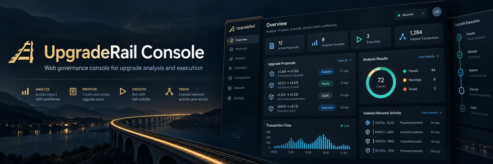

<p align="center">
  
</p>

# UpgradeRail Console

<p align="center">
  <a href="https://github.com/UpgradeRail/upgraderail-console/actions/workflows/ci.yml"></a>
  <a href="LICENSE"></a>
</p>

UpgradeRail Console is the browser-facing operations layer for UpgradeRail. It connects contract analysis, indexed governance state, wallet approvals, artifact uploads, and governed Testnet execution in one interface while keeping transaction signing in the user's wallet.

<p align="center">
  <a href="https://upgraderail-console.vercel.app">Live Testnet Console</a> |
  <a href="https://github.com/UpgradeRail/upgraderail-contracts">Contracts</a> |
  <a href="https://github.com/UpgradeRail/upgraderail-engine">Engine</a> |
  <a href="docs/staging-deployment.md">Staging evidence</a>
</p>

## Status

- Repository implementation: **READY**
- Public Testnet staging: **READY WITH CAVEATS**
- Production/Mainnet: **NOT PERFORMED**

Staging runs on free-tier hosting (Vercel, Render, Supabase) and is for Testnet only. It is not evidence of production readiness. A real Freighter sign-in on the public origin, multi-approver flows, and UpdatePolicy/UpgradeController proposals from the browser are not yet verified.

## What it does

- Indexed fleet/proposal state from the indexer
- Preflight analysis (WASM upload, Engine worker execution)
- Manifest/report display with explicit NOT PROVEN / NOT TESTED evidence states
- Freighter-based governance (create, approve, revoke, cancel, execute)
- Upgrade history
- Read-model pages: overview, activity, fleets, proposals, upgrade history

## Live Testnet staging

Primary:
- Web: https://upgraderail-console.vercel.app

Operational health:
- API: https://upgraderail-api.onrender.com/health/live
- Indexer: https://upgraderail-indexer.onrender.com/health/live
- Worker: https://upgraderail-worker.onrender.com/health/live

## How the pieces fit

```
Browser / Freighter
        |
        v
UpgradeRail Console
        |
        +--> API --> PostgreSQL
        |
        +--> Indexer --> Stellar RPC
        |
        +--> Worker --> UpgradeRail Engine
        |
        +--> UpgradeController
```

## Analysis flow

Upload current/candidate WASM -> create analysis -> worker runs Engine -> report/manifest -> governance proposal

## Governance flow

Proposal -> simulate -> Freighter sign -> submit -> confirm -> index

## Local development

1. Copy `.env.example` to `.env` and set local values.
2. Run `pnpm install --frozen-lockfile`.
3. Run `pnpm dev`.

The web app is available at `http://localhost:3000`. API, indexer, and worker services are designed to run independently.

## Public staging evidence

- [Staging deployment](docs/staging-deployment.md)
- [Testnet verification](docs/testnet-verification.md)
- [Deployment verification](docs/deployment-verification.md)

## Security and limitations

Transaction signing stays in the wallet, and the backend has no governance keys. See [SECURITY.md](SECURITY.md) and [docs/limitations.md](docs/limitations.md).

## Related repositories

- [`upgraderail-contracts`](https://github.com/UpgradeRail/upgraderail-contracts): on-chain UpgradeController governance.
- [`upgraderail-engine`](https://github.com/UpgradeRail/upgraderail-engine): Protocol 28 WASM analysis and manifest tooling.

## Contributing

See [CONTRIBUTING.md](CONTRIBUTING.md).

## License

Licensed under the [Apache-2.0](LICENSE) license.
